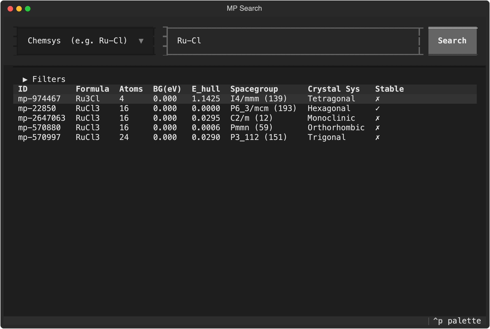
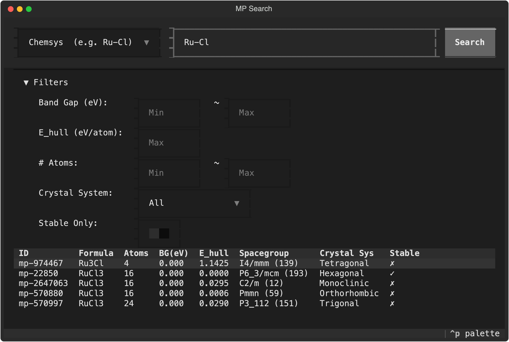

# MP Search

[](LICENSE)
[](https://www.python.org)

> [🇨🇳中文文档](README_zh.md)

A terminal-based UI tool for searching materials from the [Materials Project](https://materialsproject.org) database. Built with [Textual](https://textual.textualize.io/).

---

## Features

- **Three search modes** — Search by chemical formula, elements, or chemical system
- **Property filters** — Filter by band gap, energy above hull, atom count, crystal system, and stability
- **Material detail view** — Full properties, lattice parameters, and symmetry info
- **Export** — One-click export to POSCAR / CIF / JSON
- **Internationalization** — Chinese and English UI (configurable via `.env`)
- **Fast REST API** — Directly calls the Materials Project REST API with `requests`, avoiding compatibility issues with `mp-api`

---

## Preview






---

## Quick Start

### 1. Get an API Key

Sign up at [Materials Project](https://next-gen.materialsproject.org/api) and get your API key.

### 2. Install

```bash
git clone https://github.com/sylearn/mp-search.git
cd mp-search

python -m venv .venv
source .venv/bin/activate   # Windows: .venv\Scripts\activate

pip install -e .
```

### 3. Configure

```bash
cp .env.example .env
```

Edit `.env` and set your API key:

```env
MP_API_KEY="your_api_key_here"
```

### 4. Run

```bash
mp-search
```

---

## Configuration

| Variable | Description | Default |
|---|---|---|
| `MP_API_KEY` | **Required.** Materials Project API key | — |
| `MP_EXPORT_DIR` | Export directory path | `./result/mp_search` |
| `MP_SEARCH_LANG` | UI language: `zh` or `en` | `zh` |

---

## Keyboard Shortcuts

| Key | Action |
|---|---|
| `/` | Focus search input |
| `f` | Toggle filter panel |
| `Enter` | View selected material detail |
| `e` | Export selected material |
| `Escape` | Back from detail |
| `q` | Quit |

---

## Project Structure

```
mp-search/
├── pyproject.toml          # Package configuration
├── .env.example            # Environment template
├── LICENSE
├── README.md               # English docs
├── README_zh.md            # Chinese docs
└── mp_search/              # Python package
    ├── __main__.py          # CLI entry point
    ├── config.py            # Configuration loader
    ├── i18n.py              # Internationalization
    ├── api/
    │   └── client.py        # Materials Project REST API client
    ├── export/
    │   └── writer.py        # POSCAR / CIF / JSON export
    └── tui/
        ├── app.py           # Main TUI application
        └── detail.py        # Material detail modal
```

---

## Development

```bash
pip install -e .

# Changes take effect immediately — just rerun
mp-search
```

---

## License

[MIT](LICENSE)
