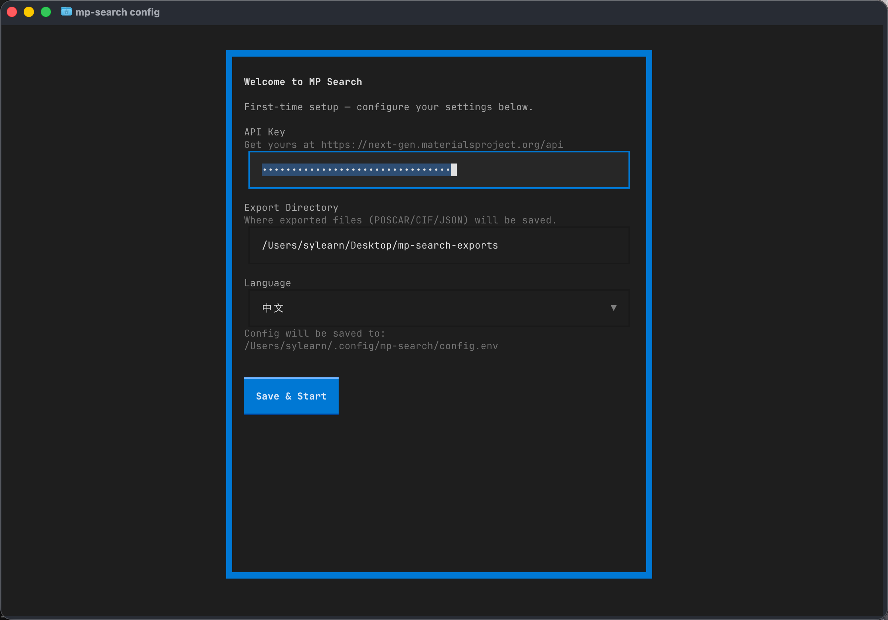
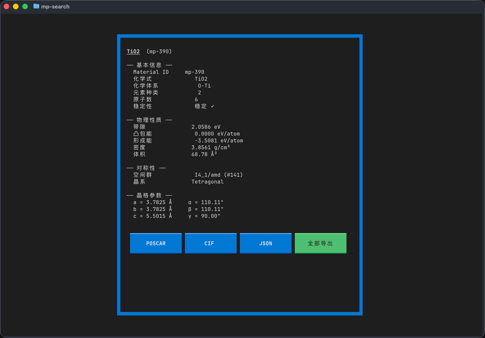

# MP Search

[](https://pypi.org/project/mp-search/)
[](https://pypi.org/project/mp-search/)
[](LICENSE)

> [中文文档](README_zh.md)

A terminal UI tool for searching materials from the [Materials Project](https://materialsproject.org) database. Built with [Textual](https://textual.textualize.io/).

## Preview






---

## Features

- **Three search modes** — Search by chemical formula, elements, or chemical system
- **Property filters** — Filter by band gap, energy above hull, atom count, crystal system, and stability
- **Material detail view** — Full properties, lattice parameters, and symmetry info
- **Export** — One-click export to POSCAR / CIF / JSON
- **First-run setup wizard** — Interactive configuration on first launch, no manual file editing needed
- **Internationalization** — Chinese and English UI

---

## Installation

### From PyPI (recommended)

```bash
pip install mp-search
```

Or with [uv](https://docs.astral.sh/uv/):

```bash
# Install as a global tool
uv tool install mp-search

# Or run directly without installing
uvx mp-search
```

### From source

```bash
git clone https://github.com/sylearn/mp-search.git
cd mp-search
pip install -e .
```

---

## Configuration

### First launch (recommended)

Simply run `mp-search`. If no configuration is found, an **interactive setup wizard** will guide you through entering:

- **API Key** — get yours at [Materials Project](https://next-gen.materialsproject.org/api)
- **Export directory** — where to save POSCAR / CIF / JSON files
- **Language** — English or Chinese

Settings are saved to `~/.config/mp-search/config.env`.

### Manual configuration

You can also set environment variables directly or create a config file:

```bash
# Option 1: Shell environment
export MP_API_KEY="your_key_here"

# Option 2: Config file
mkdir -p ~/.config/mp-search
cat > ~/.config/mp-search/config.env << 'EOF'
MP_API_KEY="your_key_here"
MP_EXPORT_DIR="~/mp-search-exports"
MP_SEARCH_LANG="en"
EOF
```

| Variable | Description | Default |
|---|---|---|
| `MP_API_KEY` | **Required.** Materials Project API key | — |
| `MP_EXPORT_DIR` | Export directory path | `~/mp-search-exports` |
| `MP_SEARCH_LANG` | UI language: `zh` or `en` | `en` |

Config lookup order: environment variables → `~/.config/mp-search/config.env` → `.env` in current directory.

### Reconfigure

```bash
mp-search config          # Re-open setup wizard
mp-search config --show   # Show current config
mp-search config --reset  # Delete config file
```

---

## Usage

```bash
mp-search
```

### Keyboard Shortcuts

| Key | Action |
|---|---|
| `/` | Focus search input |
| `f` | Toggle filter panel |
| `Enter` | View selected material detail |
| `e` | Export selected material |
| `Escape` | Back from detail |
| `q` | Quit |

---

## Project Structure

```
mp-search/
├── pyproject.toml
├── .env.example
└── mp_search/
    ├── __main__.py      # CLI entry point
    ├── config.py         # Multi-location config loader
    ├── i18n.py           # Internationalization
    ├── api/client.py     # REST API client
    ├── export/writer.py  # POSCAR / CIF / JSON export
    └── tui/
        ├── app.py        # Main TUI
        ├── detail.py     # Detail modal
        └── setup.py      # First-run setup wizard
```

---

## Community

Shared and discussed on [LINUX DO](https://linux.do/).

---

## License

This project is licensed under [GPL-3.0](LICENSE) for open-source use.

**Commercial licensing**: For commercial use or proprietary integration, please contact the author for a separate commercial license.

- Email: sylearn@foxmail.com
- GitHub: [@sylearn](https://github.com/sylearn)
