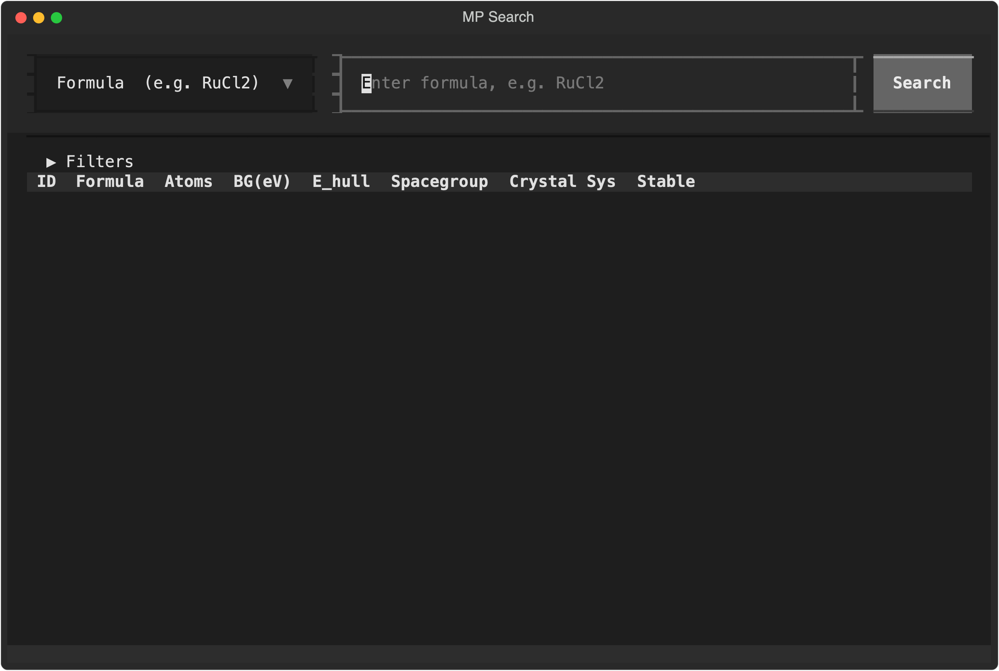
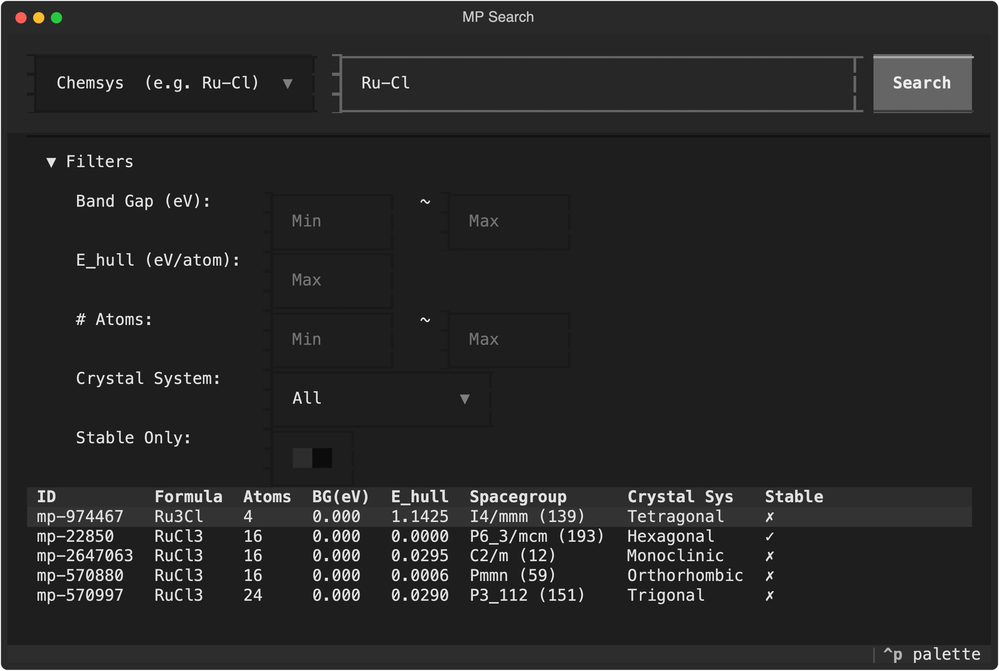

# 当 TUI 遇上材料科学：我做了一个终端里的 Materials Project 搜索工具

最近这段时间，终端界面（TUI）程序突然火了起来。Claude Code、Aider、LazyGit……越来越多开发者开始重新审视终端的魅力——轻量、高效、键盘驱动、不需要在浏览器和各种 GUI 之间切换。

我做计算材料学研究时，常年跟 Materials Project 打交道。每次要查一批材料的结构和性质，要么在网页上一个一个搜，要么写脚本调 API 然后看 JSON 输出。两者都不够顺手。网页慢，脚本又没有交互性。

于是我想：既然 TUI 这么好用，能不能做一个终端版的 Materials Project 搜索器？

搜索、筛选、看详情、导出结构文件——全在终端里完成，键盘操作，不用离开命令行。

这就是 **MP Search** 的由来。

---

## 长什么样？

### 主界面

一启动就是搜索栏 + 结果表格的布局。上方可以选搜索模式（化学式 / 元素 / 化学体系），输入关键词回车即可搜索。



### 搜索结果

比如搜索 Ru-Cl 化学体系，立刻返回所有相关材料。表格里能看到 Material ID、化学式、原子数、带隙、凸包能、空间群、晶系等关键信息。


### 筛选面板

按 `f` 展开筛选面板，可以按带隙范围、凸包能、原子数、晶系、是否稳定等条件过滤结果。



### 材料详情 & 导出

选中一行按 Enter 进入详情页，看完整的晶格参数、对称性信息。直接点按钮就能导出 POSCAR / CIF / JSON 文件。

---

## 为什么不直接用 mp-api？

做的过程中踩了个坑值得一提。

一开始我用的是官方的 `mp-api` Python 库。结果发现它在 Python 3.13 + Textual TUI 环境下会报一个诡异的错误：`bad value(s) in fds_to_keep`。原因是 `mp-api` 内部的 HTTP 请求和进度条处理与 Textual 的事件循环产生了文件描述符冲突。

最终解决方案很直接：不用 `mp-api`，改成直接用 `requests` 调 Materials Project 的 REST API。代码量反而更少了，稳定性也好了很多。

---

## 技术栈

- **Textual** — Python 写的 TUI 框架，样式和交互体验接近 Web
- **requests** — 直接调用 Materials Project REST API
- **pymatgen** — 处理晶体结构，导出 POSCAR / CIF
- **python-dotenv** — 管理环境变量

整个项目就这几个依赖，干净利落。

---

## 怎么用？

安装只需要三步：

```bash
# 克隆项目
git clone https://github.com/sylearn/mp-search.git
cd mp-search

# 创建虚拟环境并安装
python -m venv .venv && source .venv/bin/activate
pip install -e .

# 配置 API Key
cp .env.example .env
# 编辑 .env，填入你的 MP_API_KEY
```

然后在终端里输入 `mp-search` 就启动了。

常用快捷键：

| 按键 | 功能 |
|------|------|
| `/` | 跳到搜索框 |
| `f` | 展开/收起筛选 |
| `Enter` | 查看详情 |
| `e` | 导出文件 |
| `q` | 退出 |

界面默认中文，在 `.env` 里把 `MP_SEARCH_LANG` 设为 `en` 就切换成英文。

---

## 写在最后

这个项目的初衷很简单：让材料搜索回到终端里，少一些切换窗口，多一些专注。

如果你也在做计算材料学，或者只是对 TUI 程序感兴趣，欢迎试试看。

项目开源在 GitHub：**https://github.com/sylearn/mp-search**

有问题或者想法，随时提 Issue。
